# TornManager

Tools for [Torn](https://www.torn.com) players: a web platform at
[tornmanager.com](https://tornmanager.com) and a family of companion userscripts
that run inside Torn itself. Built and run by Bram
[[2728237](https://www.torn.com/profiles.php?XID=2728237)].

## What's in here

**The platform** — a Rails app serving faction dashboards, ranked war tracking,
personal statistics with nightly snapshots, and the Xanax-based subscription
system that powers everything else. It also runs the background pipelines: a
rate-limited Torn API client, daily sync jobs on Solid Queue, and the admin
tooling to watch it all.

**TM Chats** ([`userscripts/tm-chats/`](userscripts/tm-chats/README.md)) — chat
rooms for Torn players, beyond the faction and private chats the game provides.
Private rooms are end-to-end encrypted in the browser; public rooms include
anonymous ones with permanent pseudonyms. Chats are free with a TornManager
account; a subscription unlocks extras such as the Ranked War tab.
[Install](https://github.com/ibramsterdam/tornmanager/raw/main/userscript/tm-chats.user.js)

**TM Recruiter** ([`userscripts/tm-recruiter/`](userscripts/tm-recruiter/README.md)) —
a company recruiting scout. The server sweeps public game data daily (company
rosters, Hall of Fame working stats, player factions, online status) and the
script shows which high working-stat players work in the company types you
target, who is online right now, and who is faction-loyal to their director.
Requires a subscription.
[Install](https://github.com/ibramsterdam/tornmanager/raw/main/userscript/tm-recruiter.user.js)

Both scripts share one account, one subscription, and one common core
([`userscripts/shared/`](userscripts/shared/)).

## Why open source

Torn tools ask players to paste in API keys, and userscripts run inside the
game's own pages. The only honest answer to "what does this thing do with my
key?" is code you can read. Everything is here: what travels to the server,
what stays in your browser, and what every background job fetches — each Torn
API call is tagged (`tmanager`, `tmchats`, `tmrecruiter`) so key owners can
audit usage in their own Torn key log. Nothing about the product depends on
secrecy; paid features are gated server-side by the subscription, not by hiding
the source. The policies live at
[tornmanager.com/legal](https://tornmanager.com/legal).

## Layout

| Path | What |
|---|---|
| `app/`, `config/`, `db/` | The Rails 8 platform (SQLite, Solid Queue/Cache/Cable, Hotwire, Kamal deploys) |
| `userscripts/tm-chats/` | TM Chats source (Vite + vite-plugin-monkey, vanilla JS) |
| `userscripts/tm-recruiter/` | TM Recruiter source |
| `userscripts/shared/` | Auth, storage, and API plumbing shared by both scripts |
| `userscript/` | Built release artifacts — installed scripts auto-update from these exact paths, so they never move |

Userscript releases are cut with `bin/publish [tm-chats|tm-recruiter]`; see the
per-script READMEs for development setup.
